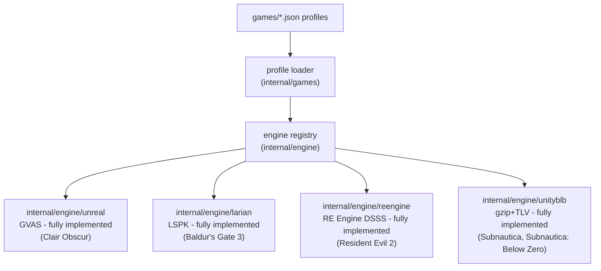

# Engine Architecture Diagram

Referenced from [`dev.md`'s "Engine Abstraction" section](../dev.md#engine-abstraction).

```mermaid
flowchart TD
    profiles["games/*.json profiles"] --> loader["profile loader\n(internal/games)"]
    loader --> registry["engine registry\n(internal/engine)"]

    registry --> unreal["internal/engine/unreal\nGVAS - fully implemented\n(Clair Obscur)"]
    registry --> larian["internal/engine/larian\nLSPK - fully implemented\n(Baldur's Gate 3)"]
    registry --> reengine["internal/engine/reengine\nRE Engine DSSS - fully implemented\n(Resident Evil 2)"]
    registry --> unityblb["internal/engine/unityblb\ngzip+TLV - fully implemented\n(Subnautica, Subnautica: Below Zero)"]
```
